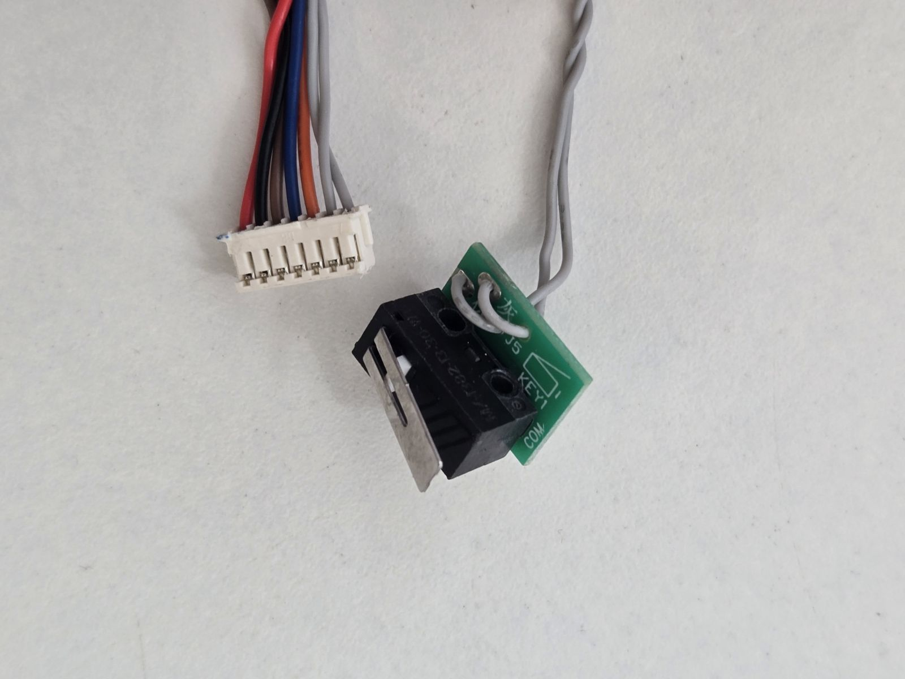

# Drive wheel module — motor, encoder, gearbox and wheel-drop sensor

Spec sheet for the aftermarket Roborock S5 Max–family drive wheel module, measured on a
physical unit. Covers the electrical side (motor + Hall encoder wiring, verified pinout)
and the mechanical side that odometry depends on (gear teeth counted, encoder edges per
revolution, mm per edge).

Everything marked **VERIFIED** was measured by me on the unit described under
*Provenance*. Everything else is flagged as estimated, inherited from generic family data,
or open.

## Provenance

| Field | Value |
|---|---|
| Part | Drive wheel module (left/right pair), aftermarket replacement |
| Advertised compatibility | Roborock S5 Max / S6 MaxV / S6 Pure / S7 Pro / E4 |
| Vendor | AliExpress — [listing 1005007359089056](https://es.aliexpress.com/item/1005007359089056.html) |
| Unit tested | One module, disassembled |
| Motor can markings | `CDM-MOTOR` / `GM-RS360-16248` / `DC 12.0V` / `20231209C1` |
| Measured by | [@IKsares](https://github.com/IKsares), July 2026 |
| Instruments | Digital multimeter, bench supply, calipers |

> ⚠️ **This is an aftermarket module, not an OEM Roborock teardown.** The motor fitted here
> is a CDM `GM-RS360-16248`. An OEM module, or another aftermarket batch, may ship a
> different motor or a different wire colour code. Check the can markings against yours
> before trusting the pinout below.

## 1. Motor identification

| Field | Value | Status |
|---|---|---|
| Manufacturer | CDM (Chinese OEM) | from can marking |
| Model | `GM-RS360-16248` | from can marking |
| Frame family | RS-360 class | inferred from format |
| Type | Brushed DC, permanent magnet | VERIFIED |
| Rated voltage | 12 V DC | from can marking |
| Feedback | Single-channel Hall sensor on a rear-cap PCB, reading a magnetic ring on the shaft | VERIFIED |
| Mechanical output | Metal pinion on the front shaft (11 teeth) | VERIFIED |
| Interconnect | 5-wire pigtail soldered to the rear PCB | VERIFIED |
| Datasheet | **None published** for this variant | — |

`20231209C1` fits a date/lot code pattern (2023-12-09, lot C1); not confirmed by the
manufacturer.

Generic RS-360 family figures circulated by distributors — ≈12 000 rpm no-load at 12 V,
3–10 W, ≈52 g, 6–24 V operating range, can ≈Ø27 mm × ≈50 mm long — are **order-of-magnitude
only**. They were not measured on this unit and should not be quoted as the part's
specification, nor used as CAD dimensions.

### Winding resistance and stall current — VERIFIED

Measured with the **rotor locked**, on the motor leads, driving a known current from a
current-limited bench supply and reading the terminal voltage. Three operating points:

| Current | Terminal voltage |
|---|---|
| 0.27 A | 3.30 V |
| 0.50 A | 4.43 V |
| 1.00 A | 7.00 V |

A brushed motor is not a pure resistor: the brush-to-commutator contact drops a roughly
**constant** voltage that does not scale with current. Fitting `V = V₀ + I·R` by least squares:

| Parameter | Value |
|---|---|
| **Winding resistance R** | **5.08 Ω** |
| **Brush contact drop V₀** | **1.91 V** |
| Fit residuals | < 25 mV at all three points |

The fit is linear across the whole measured range, so the split between winding and brush drop
is a real feature of the motor, not an artefact of two points.

> ⚠️ **Do not compute stall current as V/R from a low-current measurement.** The naive
> quotient at 0.5 A gives an apparent 8.86 Ω, because it charges the fixed ~1.9 V brush drop as
> if it were resistance. That **underestimates stall current by about 60%** — exactly the kind
> of error that leaves an H-bridge undersized.

Stall current, `I = (V − V₀) / R`:

| Supply | Stall current |
|---|---|
| 12 V | 1.99 A |
| 14.4 V (4S nominal) | 2.46 A |
| **16.8 V (4S fully charged — worst case)** | **2.93 A** |

**Upper bound, model-independent:** even if the brush drop vanished entirely at high current,
Ohm's law alone caps the draw at 16.8 / 5.08 = **3.31 A**. This motor cannot ask for more than
that on a fully charged 4S pack, whatever the brushes do.

That matters for the driver choice: the DRV8870 / TMI8870 on the reference I/O board is rated
3.6 A peak, so it clears the worst case — by 23% on the fitted figure, 9% on the hard upper
bound. The `SPEC.md` placeholder of "3.5 A (TODO — needs verification)" turns out to have been
a good guess.

**Caveats.** Measured cold; copper gains roughly 25% resistance at 80 °C, so a hot motor draws
*less* — the figures above are the conservative end. Stall is extrapolated 3× beyond the
highest measured point. And these were taken at **one rotor position**: with few commutator
segments the resistance varies with shaft angle, and the minimum-resistance position is the one
that sets the true peak. That sweep is still open (§9), and it is the only thing that could
push this motor past the driver's rating.

> **An ohmmeter will not reproduce these numbers — don't try to check them that way.** At the
> sub-milliamp test current of a multimeter's resistance range, the reading is dominated by the
> brush-to-commutator contact and its oxide film, not by the copper. On this motor an ohmmeter
> gave anything from 14 Ω to over 100 Ω depending on shaft angle and on the moment, and was not
> repeatable: a later sweep bottomed out at 20 Ω where an earlier static reading had given 14 Ω.
> None of that reflects the winding. Drive a known current and read the terminal voltage, as
> above. The ohmmeter is good only for confirming the order of magnitude — which it does: tens
> of ohms apparent, not single digits, is what rules out the shaft having been spinning.

## 2. Wiring — VERIFIED

Five wires leave the rear PCB. Two are the motor winding, three are the Hall sensor.

| Wire colour | Function | Notes |
|---|---|---|
| red | motor terminal 1 | polarity only sets rotation direction |
| black | motor terminal 2 | interchangeable with red |
| orange | Hall sensor **VCC** | verified working at 3.3 V, ≈2.5 mA |
| brown | Hall sensor **GND** | sensor reference |
| blue | Hall sensor **OUT** | swings 0 V ↔ VCC, no external pull-up needed |

> ⚠️ **Colour-code warning.** The sensor wiring does **not** follow the common industrial
> convention (brown = +, blue = 0 V). On this unit **brown is GND and orange is VCC**.
> Any harness, schematic or assembly instruction must state this explicitly — wiring it
> "the usual way" reverses the sensor supply.

The PCB silkscreen reads `红 黑 棕 蓝 橙` (red, black, brown, blue, orange) next to the five
solder pads. It labels only the **wire colour** expected at each pad — it does not document
the signal function. The pad order on the board is therefore red, black, brown, blue,
orange; the function mapping is the one in the table above.


The motor winding is **galvanically isolated** from the sensor circuit (no continuity
between the red/black pair and any of the three sensor wires).

### Module connector and harness — VERIFIED

All seven conductors terminate in a **single 7-way connector**.

> **Orientation reference:** pins numbered left to right **viewed from the wire side, with the
> retention latches facing up** — the view in the photo below.

| Pin | Wire | Function |
|---|---|---|
| 1 | wheel-drop switch | dry contact, no polarity |
| 2 | wheel-drop switch | dry contact, no polarity |
| 3 | orange | Hall VCC |
| 4 | blue | Hall OUT |
| 5 | brown | Hall GND |
| 6 | black | motor terminal |
| 7 | red | motor terminal |

The wheel-drop pair is at one end and the motor pair at the other, with the three Hall
conductors between them. Their colour depends on which side the module is from — see §5.

| Harness | Value |
|---|---|
| Conductors | 7 |
| **Pitch** | **1.5 mm** — measured 9.0 mm centre-to-centre from pin 1 to pin 7, ÷6 |
| **Connector family** | **JST ZH 1.5 mm**, or a pitch-compatible clone — no manufacturer marking is visible, so the pitch is what is verified, not the brand |
| **Total length** | **220 mm** |
| **Free length past the cable guide** | **155 mm** — the bundle is threaded through a moulded guide on the module, so this is the length a harness design can actually work with |



> **1.5 mm is the same pitch the I/O board already uses.** The current OOMWOO schematic
> specifies a board-side 5-pin JST ZH 1.5 mm for the wheel
> ([OsakaTX](../../OsakaTX/io-board-wheel-connector-and-caster.md), footprint
> `CONN-SMD_5P-P1.50_ZX-ZH1.5-5PWT`). The module side is the same family and pitch — the only
> mismatch is the way count, 7 vs 5, because the module brings motor power and the wheel-drop
> pair out on the same connector. This also rules out Scowt's tentative "might be XH", which
> would be 2.5 mm.

### How it was verified

1. **Power circuit.** Continuity confirmed between red/black and the two brush tabs on the
   can. The other three wires show no continuity to the tabs.
2. **Diode-mode mapping** of the three sensor wires (red probe on the first wire listed):

   | Pair | Reading |
   |---|---|
   | brown → blue | 0.43 V |
   | orange → brown | 0.957 V |
   | brown → orange | OL |
   | blue → brown | OL |
   | blue → orange | OL |
   | orange → blue | OL |

   The 0.957 V drop orange→brown corresponds to two junctions in series (series protection
   diode on the supply + internal path of the IC), identifying **orange as VCC**. Conduction
   brown→blue with no conduction at all *from* blue is consistent with **brown as ground**.
3. **Functional test.** 3.3 V applied to orange through a 220 Ω series resistor, brown to
   supply ground. Measured 2.76 V at orange → 0.54 V across the resistor → **≈2.5 mA draw**,
   consistent with a digital Hall IC. Spinning the shaft by hand, blue **toggles between
   0 V and 2.7 V** — essentially rail to rail.

Two conclusions follow from the functional test: the sensor is operational at **3.3 V**,
which rules out the classic 4.5–24 V Hall parts (A3144 class) and points to a modern
low-voltage IC; and the output reaches nearly VCC with no external resistor, so **no
external pull-up is required** (the stage is push-pull, or the board carries its own
pull-up — a resistor is visible on the silkscreen).

## 3. Gearbox — VERIFIED

Compound spur gear train, four reduction stages from the motor pinion to the wheel output.
Teeth counted on the opened gearbox.

| Stage | Driver (teeth) | Driven (teeth) | Ratio |
|---|---|---|---|
| Motor pinion → gear 1 | 11 | 36 | 3.273 |
| Gear 1 pinion → gear 2 | 13 | 42 | 3.231 |
| Gear 2 pinion → gear 3 | 12 | 34 | 2.833 |
| Gear 3 pinion → gear 4 (output) | 11 | 24 | 2.182 |

**Total reduction i = (36·42·34·24) / (11·13·12·11) = 1 233 792 / 18 876 ≈ 65.36 : 1**
(motor revolutions per wheel revolution).

## 4. Encoder resolution and odometry — MEASURED, with a caveat

Base measurement: **4 rising edges per motor revolution**, i.e. 4 pulse cycles per
revolution → the magnetic ring has **4 pole pairs (8 poles)**.

**Method, and its limits.** The motor was out of the gearbox and its shaft turned slowly by
hand while watching the blue line toggle on a multimeter — so this counts edges per *motor*
revolution, not per wheel revolution. **No oscilloscope and no frequency counter were used.**
A multimeter's refresh rate is slow, so this is only reliable if the shaft is turned slowly
enough that no transition is missed. If any were missed, **4 is a lower bound** and the real
count would be a multiple of it — 8 pole pairs would halve every distance below. The figure
is consistent with the independent cross-check in §7, but a scope capture would settle it.

Fixed data used below: gearbox reduction 65.36 : 1; wheel outer diameter **71.5 mm**
(measured with calipers); wheel circumference π × 71.5 = **224.6 mm**.

| Quantity | Rising edges only | Both edges (rising + falling) |
|---|---|---|
| Edges per motor revolution | 4 | 8 |
| Edges per wheel revolution | 4 × 65.36 ≈ **261.5** | 8 × 65.36 ≈ **522.9** |
| **Distance per edge** | 224.6 / 261.5 ≈ **0.859 mm** | 224.6 / 522.9 ≈ **0.430 mm** |
| Ticks per metre | ≈ **1164** | ≈ **2328** |
| Angular resolution at the wheel | ≈ 1.38° | ≈ 0.69° |

Firmware can count rising edges only (0.859 mm/edge) or both edges to double the resolution
(0.430 mm/edge) with no hardware change.

> **Design limitation:** single channel. This gives speed and distance, **not direction and
> not absolute position**. Direction has to be inferred from the polarity the controller
> applies to the motor. Closed-loop position control or feedback-based direction sensing
> would need a second sensor in quadrature.

## 5. Wheel-drop sensor — PARTIALLY characterized

A second sensor sits in the module's wire bundle: the wheel-drop (wheel-lift) detector that
[SPEC.md](https://github.com/makerspet/oomwoo-one-cad/blob/main/docs/SPEC.md) expects one of
per wheel.

| Field | Value | Status |
|---|---|---|
| Markings | `MG01-13` / `5P30-M55-W8W` | recorded |
| Manufacturer | Unknown — neither marking resolves to a public datasheet (OEM part) | — |
| Type | **SPDT snap-action microswitch** — three terminals, COM / NO / NC, with a lever | VERIFIED |
| Mounting | Soldered to a **small carrier PCB**, not wired directly; the two harness wires land on that PCB | confirmed |
| Carrier PCB silkscreen | **`COM`** and **`KEY1`** | read off the photo |
| Wiring | Two wires, both the same colour — **brown on the left module, grey on the right** | confirmed on both |
| Polarity | None — a dry contact, so the two wires are electrically interchangeable | — |
| **Contacts used** | **COM and NC** — the normally-closed branch. NO is left unused | VERIFIED |

### Contact behaviour — VERIFIED

| Lever | COM–NC | COM–NO | Harness (the two wires) |
|---|---|---|---|
| At rest (not pressed) | **closed** | open | **closed — continuity** |
| Pressed | open | closed | **open** |

Standard SPDT behaviour, and the module wires the **normally-closed** branch: **at rest the
two harness wires show continuity, and pressing the lever opens the circuit.** The NO terminal
is present but unused, so a design that needs the inverse sense can re-land one wire rather
than invert it in firmware.

This is consistent with `KEY1` being the pad that carries the NC contact, though the pad-to-
terminal mapping was not traced.

> **What the NC choice implies.** Wiring the normally-closed branch is the classic fail-safe
> arrangement: a broken wire, a popped connector or a corroded contact all read as *open*, the
> same as the alarm condition. For that to actually be safe, *open* must be the **wheel-dropped**
> state — which means the lever should be **pressed when the wheel drops**, not when it
> retracts. That is an inference from the design choice, not a measurement: the mechanical
> correspondence is still open below. **Firmware should treat open as wheel-dropped and stop**,
> which is the safe reading whichever way the mechanism turns out to work.

Note also that `MG01-13` may be the **carrier PCB's** designation rather than the switch model,
which would explain why neither marking resolves publicly.

**The switch wire colour encodes the side.** Both modules of the pair were checked: the left
one has the pair in brown, the right one in grey. That is worth knowing — it is the only
external marking that tells the two modules apart once they are off the robot.

It also resolves what looked like a contradiction with [Scowt](../../Scowt/DriveWheel.md),
who describes the limit switch on **two grey wires**: that matches the right-hand module.
Both descriptions are correct, for different sides.

> ⚠️ **On the left module, three brown wires carry three different functions** — the Hall
> sensor GND (§2) plus both wheel-drop switch wires. There, colour cannot identify a
> conductor: go by connector position or by continuity. The failure is silent — connecting a
> switch wire where the Hall ground belongs shorts nothing, it just leaves the sensor
> unreferenced and the encoder dead with no visible cause. The right module does not have
> this ambiguity (one brown, two grey).

### Still open

Measurable now, even with the switch out of the module (multimeter, no power):

- [ ] Contact rating, if printed on the body
- [ ] Where each marking is printed — switch body, carrier PCB, or harness

Needs the module assembled, or at least the switch offered up to its seat:

- [ ] **Which mechanical state means *wheel retracted*** (robot resting on the floor, wheel
      pushed up into the body) vs *wheel dropped* (robot lifted, spring extends the wheel).
      Firmware needs this to fail safe — a wheel-drop that reads inverted means the robot
      stops on the floor and drives happily while held in the air
- [ ] What actuates it — typically the suspension arm as the wheel travels up

## 6. Integration requirements

1. **Sensor supply: 3.3 V or 5 V**, to match the controller logic. Verified at 3.3 V here;
   5 V not tested on this unit. **Do not feed the sensor from 12 V** until the Hall IC is
   identified and its maximum supply confirmed.
2. **Common ground.** Tie sensor GND (brown) to the motor driver negative at a single point
   near the controller, so motor return current does not flow through the sensor reference.
3. **Decoupling.** 100 nF between orange and brown, as close to the motor as possible.
4. **Signal filtering.** A brushed motor at speed generates significant commutation noise.
   If spurious pulses appear under load, add an RC filter (1 kΩ + 10 nF) on the blue line
   before the MCU input.
5. **Harness.** Keep the sensor wires physically away from the power wires; twisting the
   red/black pair reduces emission.

## 7. Cross-checks against existing contributions

### Confirms [Scowt/DriveWheel.md](../../Scowt/DriveWheel.md)

Scowt's pinout is explicitly flagged as tentative — inferred from photos and a
StackExchange thread, with "some uncertainty around the encoder wires". The mapping guessed
there is **confirmed correct on this physical unit**:

| Scowt (tentative) | This unit (verified) | Result |
|---|---|---|
| pin 1 — limit switch | pin 1 — wheel-drop switch | ✅ |
| pin 2 — limit switch | pin 2 — wheel-drop switch | ✅ |
| pin 3 — encoder 5 V, orange | pin 3 — orange, Hall VCC | ✅ (verified working at 3.3 V) |
| pin 4 — encoder signal, blue | pin 4 — blue, Hall OUT | ✅ |
| pin 5 — encoder ground, brown | pin 5 — brown, Hall GND | ✅ |
| pin 6 — motor power, black | pin 6 — black, motor terminal | ✅ |
| pin 7 — motor power, red | pin 7 — red, motor terminal | ✅ |
| Hall-effect encoder | Hall sensor + magnetic ring | ✅ |
| Cable ~250 mm ("estimate only") | **220 mm** total, 155 mm past the cable guide | ✅ close, now measured |
| Limit switch on grey wires | grey on the right module, brown on the left | ✅ correct for the right side (§5) |

**The whole 7-pin pinout is confirmed, pin for pin.** It was inferred from photographs and a
StackExchange thread, and it turns out to be right — including the pin order, which nothing in
that thread could have established.

The one item that does not hold is the connector guess: Scowt's "JST, might be XH but not
certain" would be a 2.5 mm pitch, and the measured pitch is **1.5 mm** — ZH family (§2).

This also settles a fork in [io-pcb](../../../io-pcb/README.md), which references the
AlieksieievYurii 6-pin `JST PH2.0` pinout with a `HALL_DIR` line and asks for it to be
verified against a sourced module before layout. That pinout does not describe this module:
there are **7 conductors, not 6**, and the encoder has a single channel, so there is no
`HALL_DIR` to wire.

### Closes two open items in [OsakaTX's spec sheets](../../OsakaTX/vacuumtiger-verified-specs.md)

OsakaTX's drive wheel figures are derived — from the VacuumTiger firmware's calibration
constants, a Nidec catalogue entry, and merged PRs — with the physical work explicitly listed
as pending: *"Exact gearbox ratio via tooth count — Open gearbox, count teeth"*, and the pole
count *"speculative without physical inspection"*. This document supplies both measurements.

| Quantity | OsakaTX (derived) | Measured here | How |
|---|---|---|---|
| Gearbox ratio | ~190 : 1 | **65.36 : 1** | teeth counted, 4 spur stages |
| Magnetic ring | ~32 poles (speculative) | **8 poles (4 pole pairs)** | edges counted by hand per motor revolution, multimeter — see §4 |
| Wheel diameter | 65 mm, from alvarosamudio's simulation URDF | **71.5 mm** | calipers, on the physical wheel |
| Motor | Nidec 20N704RC70, 14.4 V (catalogue, flagged "in development") | **CDM GM-RS360-16248, 12 V** | read off the can |

The motor difference may be genuine: this is an aftermarket module, and OsakaTX's own note
warns that "the actual motor used in production Roborock wheels may differ from the catalogue
entry".

### Reconciling with `ticks_per_meter = 4464`

The one hard number on that side is `ticks_per_meter = 4464.0`, empirically calibrated on a
real robot and consistent across several VacuumTiger source files. At first glance it looks
incompatible with the measurements here (1164 ticks/m counting rising edges). It isn't — the
gap is the GD32's decoding, which OsakaTX documents: the hardware timer performs **4× edge
counting** on the single pulse train.

Applying that 4× to the measured mechanics:

```
4 cycles/motor rev  ×  4 (GD32 decoding)      =  16 ticks/motor rev
16  ×  65.36 (measured ratio)                 =  1046 ticks/wheel rev
1046  /  0.2246 m (π × 71.5 mm)               =  4656 ticks/m
```

**4656 vs the calibrated 4464 — within 4%.** The same correction runs the other way: taking
4464 ticks/m and the real 71.5 mm wheel gives 1003 ticks/wheel rev → 251 raw cycles/wheel rev,
against the 261.5 measured here. Again ~4%.

So the calibrated constant and the physical measurements agree. What does not survive are the
two intermediate derivations:

- **~228 PPR and ~32 poles** — the pole count came from dividing by a 65 mm wheel diameter
  taken from the simulation URDF. With the measured 71.5 mm the arithmetic lands on the
  8-pole ring counted here, no speculation needed.
- **~190 : 1** — derived by assuming the configured `max_linear_speed = 0.3 m/s` corresponds
  to the motor at no-load speed. It need not: with the measured 65.36 : 1 and an RS-360-class
  no-load figure (order of magnitude ≈12 000 rpm at 12 V), the wheel would top out near
  0.69 m/s, making 0.3 m/s a deliberate software limit rather than a mechanical ceiling.

Residual ~4% could be the aftermarket module differing from the OEM one, the effective
rolling diameter under load, or the calibration itself.

> **What this cross-check cannot distinguish.** It only pins down the product — **16 counts
> per motor revolution**. Two hypotheses produce it and this arithmetic cannot tell them
> apart: 4 pole pairs with the GD32's 4× decoding (assumed above), or 8 pole pairs with plain
> both-edge counting. The hand count in §4 favours the first, but it is a lower bound, so the
> second is not excluded — and it would halve every distance-per-edge figure in §4.

**Suggested checks:** put a scope on the blue line and turn the shaft one revolution — that
resolves the pole count directly. Separately, roll a wheel a measured distance (e.g. 2 m) on
the bench and count edges, which settles ticks/m end to end, independently of every
derivation above.

### Note for the I/O board design

[OsakaTX/io-board-wheel-connector-and-caster.md](../../OsakaTX/io-board-wheel-connector-and-caster.md)
has the OOMWOO wheel connector supplying the encoder at **+5 V** (`VCC-5V-WHEEL`). This sensor
is confirmed working at 3.3 V drawing ≈2.5 mA; 5 V remains untested here, and the Hall IC's
absolute maximum is unknown.

Also worth carrying into firmware: VacuumTiger resolves the single-channel direction ambiguity
with the **IMU gyro**, not with the commanded motor polarity. That is a more robust answer than
the one in §4 and is worth reusing.

## 8. Coverage against the part-specs checklist

Against the "Drive wheel assembly" list in [part-specs/README.md](../../README.md):

| Requested | Status |
|---|---|
| Motor model | ✅ `CDM GM-RS360-16248` |
| Motor/assembly datasheet | ❌ none published for this variant |
| Encoder type + PPR | ⚠️ single-channel Hall ✅; 4 rising edges/motor rev counted by hand — lower bound, see §4 |
| Gearbox ratio | ✅ 65.36 : 1, teeth counted |
| Wheel diameter | ✅ 71.5 mm OD |
| Rated voltage | ✅ 12 V (can marking) |
| Max voltage | ❌ not established |
| Current (no-load & stall) | ⚠️ stall ✅ 2.93 A at 16.8 V (§1, winding 5.08 Ω + 1.91 V brush drop); no-load current not measured |
| Torque | ❌ not measured |
| Max / rated wheel speed | ❌ not measured |
| Cable lengths | ✅ 220 mm total, 155 mm past the cable guide |
| Connector models (both ends) | ⚠️ module side: 7-way, 1.5 mm pitch (ZH family) ✅; board side is the I/O board's choice |
| Full connector + motor pinouts | ✅ both — motor-side 5-wire and the 7-pin module connector, pin for pin |
| Wheel-drop sensor model + pinout | ⚠️ SPDT microswitch, wired COM+NC (closed at rest), 2 wires, no polarity ✅; model unidentified and mechanical correspondence open — §5 |
| Signal waveforms | ❌ no scope captures (multimeter only) |
| Assembly weight | ❌ not measured |

## 9. Open points

- [ ] Motor can dimensions (diameter, body length, shaft diameter) — also needed for CAD
- [ ] Hall IC part number — requires lifting the PCB, the marked face is hidden
- [ ] **Resistance vs. rotor position** — sweep the shaft with an ohmmeter to find the
      minimum-resistance angle, then repeat the three-point measurement there. That sets the
      real peak draw, and it is the one result that could push this motor past the driver's
      3.6 A rating (§1)
- [ ] No-load current at 12 V (needs the shaft free)
- [ ] Wheel-drop switch: which mechanical state presses the lever — needs the module
      assembled. Everything electrical about it is now measured (§5)
- [ ] Confirm the connector is genuine JST ZH rather than a pitch-compatible clone (no
      manufacturer marking found; matters for sourcing the mating part, not for the pinout)
- [ ] **Confirm the pole count with a scope or frequency counter** — the hand count in §4 is
      a lower bound, and §7 cannot separate 4 pole pairs from 8
- [ ] Scope captures of the encoder output under load (noise, edge quality)
- [ ] Bench roll test (edges over a measured distance) to close the residual ~4% in §7
- [ ] Confirm whether an OEM Roborock module carries the same 4-pole-pair ring and 65.36 : 1
      train as this aftermarket one

---

Licensed under Apache 2.0, in line with the repository.
